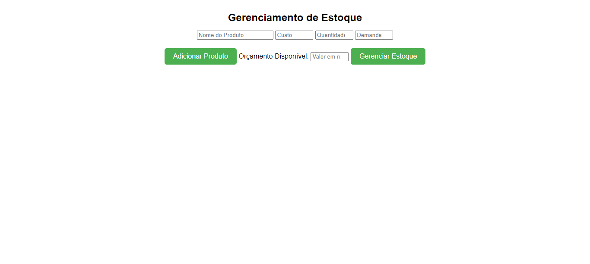
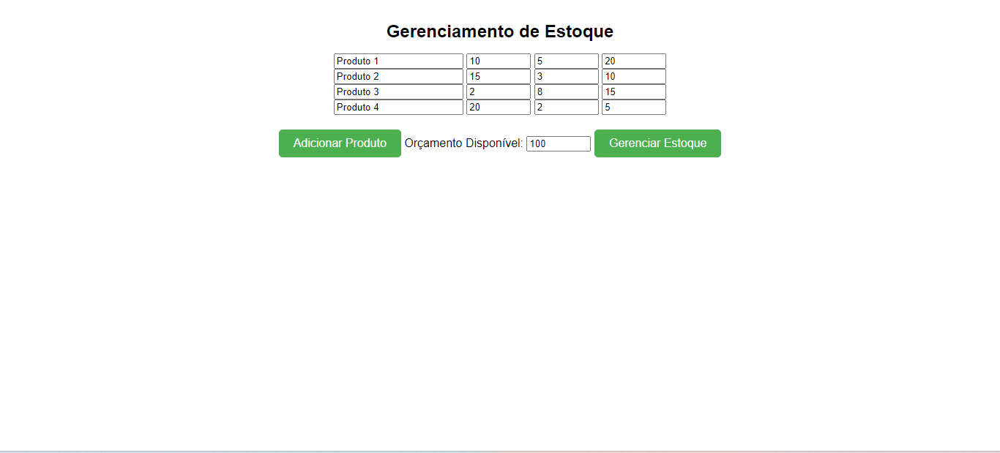
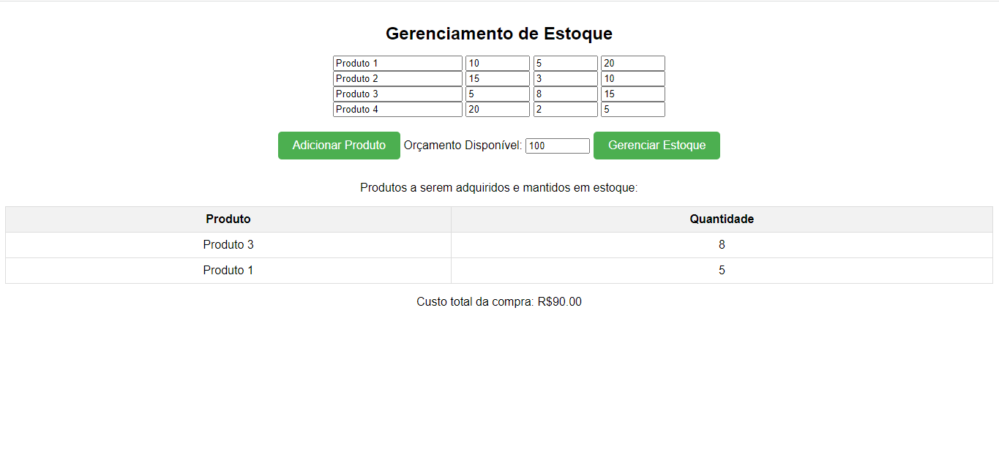

# Gerenciamento de Estoque

**Número da Lista**: 42<br>
**Conteúdo da Disciplina**: Greed<br>

## Alunos
|Matrícula | Aluno |
| -- | -- |
| 19/0118555  |  Wengel Rodrigues Farias |


## Sobre 
O projeto do Gerenciador de Estoque utiliza o algoritmo do Problema da Mochila (Knapsack) decidir quais produtos devem ser adquiridos e mantidos em estoque. Com base na demanda esperada e no orçamento disponível, o sistema calcula a relação custo-benefício de cada produto e seleciona aqueles que oferecem a melhor relação. Essa abordagem de otimização auxilia na tomada de decisões de compra e garante uma gestão eficiente do estoque.

## Screenshots


 

## Instalação 
**Linguagem**: Python<br>
**Framework**: Flask<br>

- ### Windows
Baixe o pacote Python do [site official](https://www.python.org/downloads/), e no momento da instação, marque a opção "Add Python to PATH" para no próximo passo instalar as dependências via terminal e rodar o projeto.

- ### Linux
Execute no terminal do linux a atualização dos pacotes e instalação do python3

```bash
sudo apt-get update
sudo apt-get install python3
```
# Execução
Abra um terminal na pasta **Scripts** do projeto e execute o comando:
```
.\start.bat
```
Abra outro terminal na pasta **Scripts** e execute  o comando:
```
.\venv.bat
```


## Uso 
Na interface do usuário, você verá campos de entrada para os detalhes do produto: **Nome do Produto**, **Custo**, **Quantidade Disponível** e **Demanda Esperada**. Você pode adicionar quantos produtos quiser, clicando no botão **Adicionar Produto**. Defina o orçamento. Depois de inserir todos os detalhes do produto e definir o orçamento, clique no botão **Gerenciar Estoque**.


## Video da Apresentação

[Link do Vídeo](https://www.youtube.com/watch?v=sq-GT_HDTP0&feature=youtu.be)


