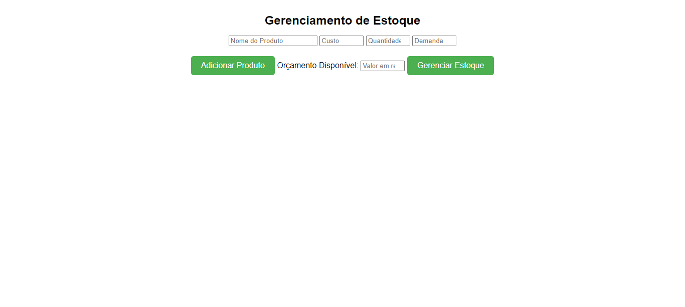
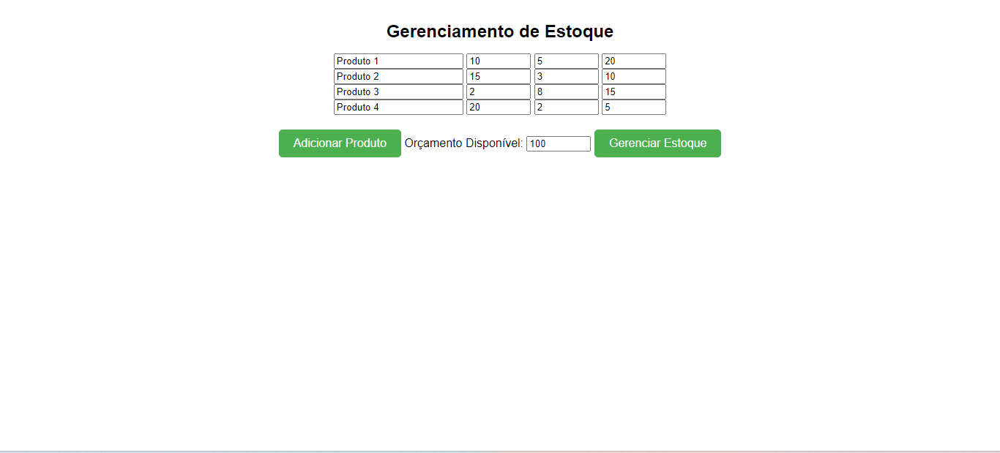
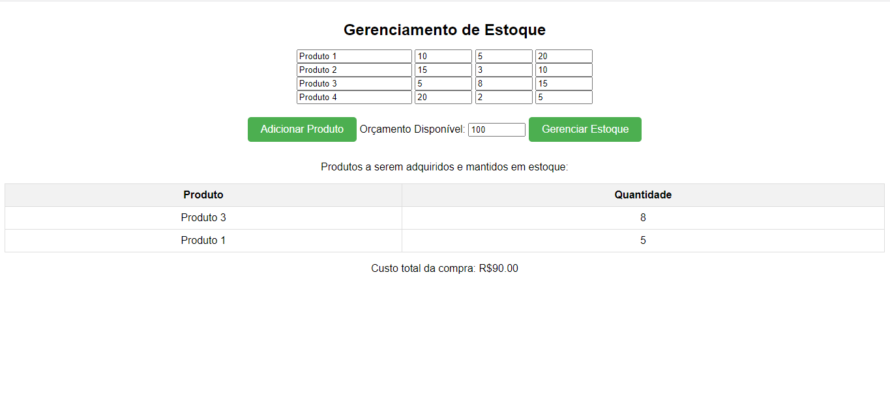

# Gerenciamento de Estoque

**Número da Lista**: 42<br>
**Conteúdo da Disciplina**: Greed<br>

## Alunos
|Matrícula | Aluno |
| -- | -- |
| 19/0118555  |  Wengel Rodrigues Farias |


## Sobre 
O projeto é um Gerenciador de Estoque, um programa que representa um conjunto de produtos como uma coleção, onde cada produto é um item na coleção e a relação custo-benefício entre demanda esperada e custo de cada produto é a métrica de decisão. O objetivo é implementar um algoritmo de otimização que, com base no orçamento disponível, determina a melhor combinação de produtos a serem adquiridos para maximizar a demanda esperada atendida e manter os custos dentro do orçamento estipulado.

## Screenshots


 

## Instalação 
**Linguagem**: Python<br>
**Framework**: Flask<br>

- ### Windows
Baixe o pacote Python do [site official](https://www.python.org/downloads/), e no momento da instação, marque a opção "Add Python to PATH" para no próximo passo instalar as dependências via terminal e rodar o projeto.

- ### Linux
Execute no terminal do linux a atualização dos pacotes e instalação do python3

```bash
sudo apt-get update
sudo apt-get install python3
```
# Execução
Abra um terminal na pasta **Script** do projeto e execute o comando:
```
.\start.bat
```
Abra outro terminal na pasta **Script** e execute  o comando:
```
.\venv.bat
```


## Uso 
Explique como usar seu projeto caso haja algum passo a passo após o comando de execução.

## Outros 
Quaisquer outras informações sobre seu projeto podem ser descritas abaixo.


